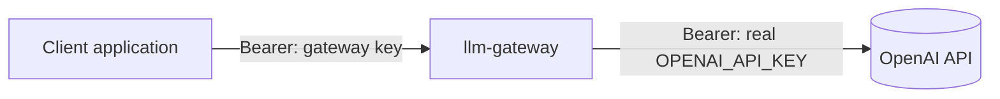
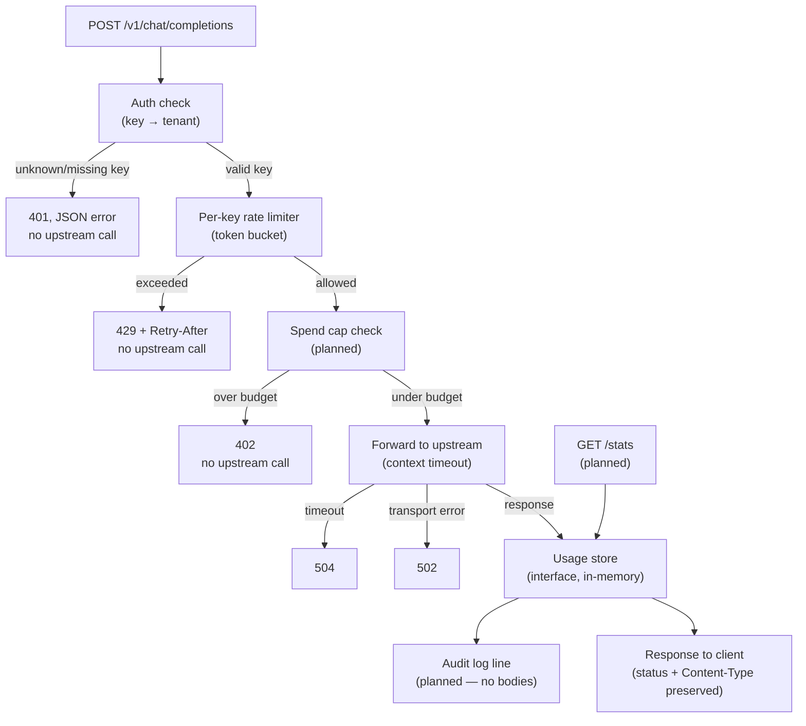

# llm-gateway

A reverse proxy that sits in front of the OpenAI API. Clients authenticate with a **gateway key**, not the real provider key — the gateway resolves that to a tenant, enforces a per-key rate limit and (soon) a spend cap, forwards the request, measures what it cost, and logs an audit line. The real `OPENAI_API_KEY` never leaves the server and is never visible to a client.

It's a small, honest version of the same problem an AI Gateway solves in production: auth, rate limiting, cost control, and an audit trail in front of an LLM provider.

## Why this exists

Most of the pieces of a "real" gateway are here in miniature, on purpose:

- **Auth** — a client-facing key resolves to a tenant; unknown or missing keys are rejected before any upstream call is made.
- **Rate limiting** — a token bucket per key, so one tenant can't flood the provider or starve another tenant's budget.
- **Spend control** *(in progress)* — cost is calculated per response and accumulated per key; once a key's budget is spent, further requests are rejected before they reach the provider.
- **Observability** *(in progress)* — a structured audit log per request (key, model, tokens, cost, latency, decision) with **no request or response content** ever written to it.
- **Usage visibility** *(in progress)* — a `/stats` endpoint reporting per-key usage, read through the same interface the proxy writes to.

Deliberately out of scope, and why: no database (an in-memory store behind an interface is the point — swapping in Postgres later touches one type, not the handlers); no frontend; no Docker/K8s; no SSE streaming passthrough (the genuinely hard part — token counting on a streamed response is a different design problem, scoped out rather than hidden).

## Architecture

### System context



The client only ever holds a gateway key. The real provider key is injected server-side and never appears in a client-facing request or response.

### Inside the gateway



Solid paths are implemented and tested by hand with curl; the "planned" boxes are US-4/US-5/US-6, next up.

## Endpoints

| Route | Purpose | Status |
|---|---|---|
| `GET /healthz` | Liveness, never touches the provider | ✅ done |
| `POST /v1/chat/completions` | Proxy — auth, rate limit, forward, measure, log | 🚧 auth + rate limit + forward done; spend cap + logging pending |
| `GET /stats` | Per-key usage: requests, tokens, estimated cost | ⬜ not started |

## User stories

Numbering matches the project's acceptance criteria doc.

| # | Story | Status |
|---|---|---|
| US-1 | Authenticated proxying — valid gateway key forwards to the provider, client never sees the real key | ✅ Done, curl-verified |
| US-2 | Reject unknown/missing keys before any upstream call | ✅ Done, automated test (`TestChatCompletions_Auth`) |
| US-3 | Per-key rate limiting (token bucket), one tenant can't affect another's limit | ✅ Done, table-driven test (`TestChatCompletions_RateLimit`: burst allowed / 6th → `429` + Retry-After / per-key isolation) |
| US-4 | Per-key spend cap, rejected before the upstream call once budget is exceeded | 🚧 In progress — concurrency-safe usage store (interface + in-memory impl) built; cost table + cap enforcement + tests pending |
| US-5 | Structured audit log per request — no request or response body ever logged | ⬜ Not started |
| US-6 | `/stats` usage visibility, read through the store interface | ⬜ Not started |
| US-7 | Liveness endpoint, doesn't touch the provider | ✅ Done |
| US-8 | Provider failures handled, not propagated blindly (timeout → 504, non-2xx passed through, malformed body doesn't panic) | ✅ Timeout → 504 and non-2xx passthrough done, with a table-driven `httptest` test (`TestChatCompletions_UpstreamFailures`: 200 passthrough / 500 / timeout→504); malformed-body handling arrives with US-5, once the response body is actually parsed |

## Definition of Done — tests

- [x] Table-driven tests, `t.Run` subtests — auth gate (`TestChatCompletions_Auth`: missing key / unrecognised key / valid key, each asserting both status code and whether the fake upstream was actually hit)
- [x] Table-driven tests on cost calculation (`cost_test.go` — known model, zero tokens, unknown model; float-epsilon comparison)
- [x] Table-driven tests on the rate limiter, including per-key isolation (`ratelimit_test.go`)
- [x] `httptest.Server` fake provider — 200 / 500 / timeout done (`TestChatCompletions_UpstreamFailures`); malformed-body case deferred to US-5 (needs response parsing)
- [ ] Fake usage store implementing the store interface — assert what was recorded
- [ ] A test asserting no request body appears in log output
- [ ] `go test ./...` green, `go vet` clean

## Design decisions

- **`UpstreamURL` and `Timeout` are both injectable via `Config`**, not hardcoded — this is what makes the whole thing testable against `httptest.Server` instead of the real OpenAI API.
- **The constructor defends against a zero-value `Timeout`.** An unset `time.Duration` is `0`, and `context.WithTimeout(ctx, 0)` creates an already-expired context — a real bug this project hit once already. `New` falls back to a sane default rather than taking zero literally.
- **`errors.Is`, not `==`, to detect a timeout.** The error from a cancelled upstream call is wrapped several layers deep (typically inside `*url.Error`); `errors.Is` walks the `Unwrap()` chain, `==` only checks the top level.
- **Token bucket over a fixed window** for rate limiting — fixed windows allow up to 2x the stated limit across a window boundary; a token bucket doesn't.
- **`Allow()`, not `AllowN()`** — the rate limiter counts requests, not cost. Cost is a separate concern owned by the spend cap, kept deliberately independent so the two don't get blurred.
- **No request/response bodies in logs, ever** — audit trail without leaking content. Same judgement call as a data-exposure fix from my day job.

## Running it

```bash
export OPENAI_API_KEY=sk-...   # or drop it in a .env, gitignored, loaded automatically
go run .
```

```bash
curl localhost:8080/healthz
# 200 OK

curl -i -X POST localhost:8080/v1/chat/completions \
  -H "Authorization: Bearer sk-demo-alice" \
  -H "Content-Type: application/json" \
  -d '{"model":"gpt-4o-mini","messages":[{"role":"user","content":"hello"}]}'
```

Seeded gateway keys (in-memory, see `main.go`): `sk-demo-alice`, `sk-demo-bob`.

## Tests

```bash
go test ./... -v
go vet ./...
```
