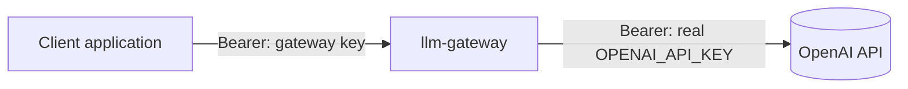
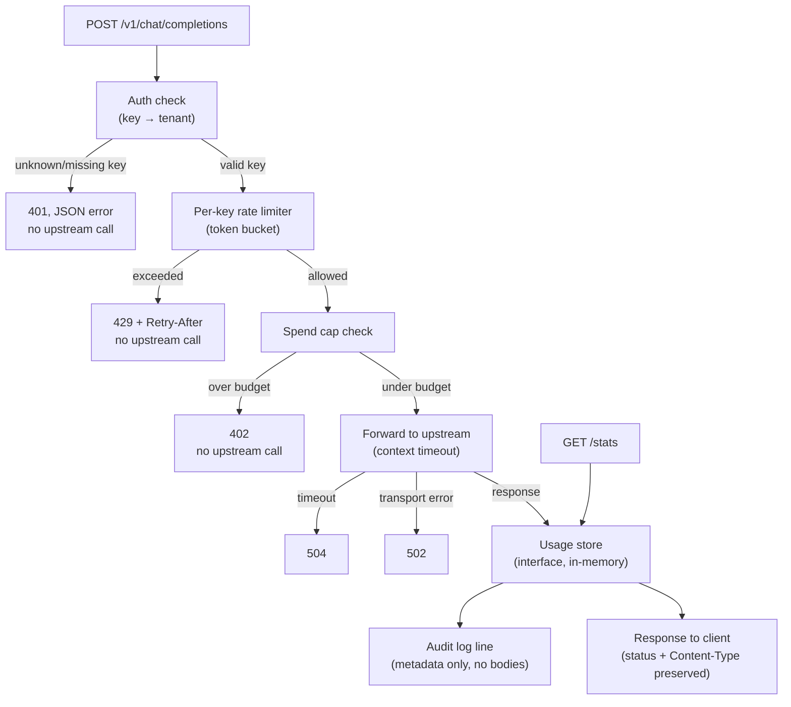

# llm-gateway

A reverse proxy that sits in front of the OpenAI API. Clients authenticate with a **gateway key**, not the real provider key — the gateway resolves that to a tenant, enforces a per-key rate limit and a spend cap, forwards the request, measures what it cost, and logs an audit line. The real `OPENAI_API_KEY` never leaves the server and is never visible to a client.

It's a small, honest version of the same problem an AI Gateway solves in production: auth, rate limiting, cost control, and an audit trail in front of an LLM provider.

## Why this exists

Most of the pieces of a "real" gateway are here in miniature, on purpose:

- **Auth** — a client-facing key resolves to a tenant; unknown or missing keys are rejected before any upstream call is made.
- **Rate limiting** — a token bucket per key, so one tenant can't flood the provider or starve another tenant's budget.
- **Spend control** — cost is calculated per response and accumulated per key; once a key's budget is spent, further requests are rejected before they reach the provider.
- **Observability** — a structured audit log per request (key, model, tokens, cost, latency, decision) with **no request or response content** ever written to it.
- **Usage visibility** — a `/stats` endpoint reporting per-key usage, read through the same interface the proxy writes to.

Deliberately out of scope, and why: no database (an in-memory store behind an interface is the point — swapping in Postgres later touches one type, not the handlers); no frontend; no Docker/K8s; no SSE streaming passthrough (the genuinely hard part — token counting on a streamed response is a different design problem, scoped out rather than hidden).

## Architecture

### System context



The client only ever holds a gateway key. The real provider key is injected server-side and never appears in a client-facing request or response.

### Inside the gateway



Every path above is implemented, unit-tested, and verified by hand with curl against the real OpenAI API.

## Endpoints

| Route | Purpose | Status |
|---|---|---|
| `GET /healthz` | Liveness, never touches the provider | ✅ done |
| `POST /v1/chat/completions` | Proxy — auth, rate limit, spend cap, forward, measure, audit log | ✅ done |
| `GET /stats` | Per-tenant usage: requests, tokens, estimated cost, budget remaining | ✅ done |

## User stories

Numbering matches the project's acceptance criteria doc.

| # | Story | Status |
|---|---|---|
| US-1 | Authenticated proxying — valid gateway key forwards to the provider, client never sees the real key | ✅ Done, curl-verified |
| US-2 | Reject unknown/missing keys before any upstream call | ✅ Done, automated test (`TestChatCompletions_Auth`) |
| US-3 | Per-key rate limiting (token bucket), one tenant can't affect another's limit | ✅ Done — limits configured per key (`KeyConfig.RPM`: alice 5/min, bob 2/min), `Retry-After` derived from the key's rate. Table-driven test (`TestChatCompletions_RateLimit`: burst allowed / 6th → `429` + Retry-After / per-key isolation) |
| US-4 | Per-key spend cap, rejected before the upstream call once budget is exceeded | ✅ Done — spend checked before the call (gate, not receipt), cost recorded per key after. Table-driven test (`TestChatCompletions_SpendCap`: first request allowed / `402` once budget spent). Soft cap: allowed on the crossing request, blocked on the next |
| US-5 | Structured audit log per request — no request or response body ever logged | ✅ Done — one structured JSON line per request via `slog` (key, model, token counts, cost, status, latency, decision), metadata only. Test (`TestChatCompletions_AuditLogNoBodies`) plants secrets in both request and response and proves neither reaches the log |
| US-6 | `/stats` usage visibility, read through the store interface | ✅ Done — `GET /stats` returns per-tenant requests/tokens/spend/budget-remaining via the store's `CurrentUsage()` snapshot. Keyed by tenant, not the API key (don't reflect credentials). Test `TestStats` |
| US-7 | Liveness endpoint, doesn't touch the provider | ✅ Done |
| US-8 | Provider failures handled, not propagated blindly (timeout → 504, non-2xx passed through, malformed body doesn't panic) | ✅ Done — timeout → 504 and non-2xx passthrough, with a table-driven `httptest` test (`TestChatCompletions_UpstreamFailures`: 200 passthrough / 500 / timeout→504); malformed body handled best-effort (unmarshal failure skips recording but still forwards the bytes — no panic); an explicit malformed-body test is still to add |

## Definition of Done — tests

- [x] Table-driven tests, `t.Run` subtests — auth gate (`TestChatCompletions_Auth`: missing key / unrecognised key / valid key, each asserting both status code and whether the fake upstream was actually hit)
- [x] Table-driven tests on cost calculation (`cost_test.go` — known model, zero tokens, unknown model; float-epsilon comparison)
- [x] Table-driven tests on the rate limiter, including per-key isolation (`TestChatCompletions_RateLimit`)
- [x] `httptest.Server` fake provider — 200 / 500 / timeout (`TestChatCompletions_UpstreamFailures`); malformed body handled best-effort in the handler (unmarshal failure skips recording, still forwards) — no dedicated case test
- [x] Fake usage store implementing the store interface — asserts the handler recorded the right key, tokens, and cost (`TestChatCompletions_RecordsUsageThroughStore`)
- [x] A test asserting no request/response body appears in log output (`TestChatCompletions_AuditLogNoBodies`)
- [x] `go test ./...` green, `go vet` clean

## Design decisions

- **`UpstreamURL` and `Timeout` are both injectable via `Config`**, not hardcoded — this is what makes the whole thing testable against `httptest.Server` instead of the real OpenAI API.
- **The constructor defends against a zero-value `Timeout`.** An unset `time.Duration` is `0`, and `context.WithTimeout(ctx, 0)` creates an already-expired context — a real bug this project hit once already. `New` falls back to a sane default rather than taking zero literally.
- **`errors.Is`, not `==`, to detect a timeout.** The error from a cancelled upstream call is wrapped several layers deep (typically inside `*url.Error`); `errors.Is` walks the `Unwrap()` chain, `==` only checks the top level.
- **Token bucket over a fixed window** for rate limiting — fixed windows allow up to 2x the stated limit across a window boundary; a token bucket doesn't.
- **`Allow()`, not `AllowN()`** — the rate limiter counts requests, not cost. Cost is a separate concern owned by the spend cap, kept deliberately independent so the two don't get blurred.
- **No request/response bodies in logs, ever** — audit trail without leaking content. Same judgement call as a data-exposure fix from my day job.
- **The usage store and logger are injectable via `Config`** (defaulting to the in-memory store and a stdout JSON logger) — the same testability lever as `UpstreamURL`. Tests swap in a fake store to assert exactly what was recorded, and a buffer logger to prove no content reaches the log.
- **The spend check is a gate before the upstream call, not a receipt after it** — a key over budget never reaches the paid provider. It's a *soft* cap: this request's cost isn't known until the response returns, so a key can tip slightly over on the crossing request and is blocked on the next. Hard-capping would need pre-estimating tokens.
- **Cost lookup prefix-matches the model family** — providers return dated snapshots (`gpt-4o-mini-2024-07-18`), not the alias the client sent. Exact-match returned "unknown model", silently skipping cost + audit; caught by curling real traffic, since the unit tests used the canonical name.
- **`/stats` is keyed by tenant, not the API key** — the key is a credential, and a stats endpoint must not reflect credentials back.
- **One `KeyConfig` struct per key** (tenant, budget, rate limit) instead of parallel maps keyed the same way — they'd drift out of sync; one struct keeps a key's config together.

## Running it

```bash
cp .env.example .env   # then edit .env and add your OPENAI_API_KEY
go run .
```

`.env` is gitignored and loaded automatically at startup. Only `OPENAI_API_KEY` is required; `UPSTREAM_URL` and `PORT` have sensible defaults.

The server listens on `:8080` (override with the `PORT` env var), and logs a `gateway listening` line on start. Every successful request prints one JSON audit line to stdout.

### Configuration

Copy `.env.example` to `.env` and fill in your key — `.env` is gitignored and loaded automatically at startup.

| Variable | Required | Default | Purpose |
|---|---|---|---|
| `OPENAI_API_KEY` | **yes** | — | Your real OpenAI key. Held server-side, never exposed to clients — they use the seeded gateway keys instead. |
| `UPSTREAM_URL` | no | `https://api.openai.com` | Provider base URL. Point at a mock or a compatible provider. |
| `PORT` | no | `8080` | Port the gateway listens on. |

Clients authenticate with the in-memory gateway keys seeded in `main.go` — `sk-demo-alice` (5 req/min, $0.10) and `sk-demo-bob` (2 req/min, $0.01) — not with your real `OPENAI_API_KEY`.

### Try it with curl

```bash
# 1. Liveness — never touches the provider
curl -i localhost:8080/healthz
# → 200 OK, body: ok

# 2. Missing/invalid key — rejected before any upstream call
curl -i -X POST localhost:8080/v1/chat/completions -d '{}'
# → 401 {"error":"missing or invalid api key"}

# 3. Valid call
curl -i -X POST localhost:8080/v1/chat/completions \
  -H "Authorization: Bearer sk-demo-alice" \
  -H "Content-Type: application/json" \
  -d '{"model":"gpt-4o-mini","messages":[{"role":"user","content":"say hello in 3 words"}]}'
# → 200 + provider response; one audit line printed server-side (metadata only, no prompt text)

# 4. Rate limit — alice is 5 req/min, so the 6th is throttled
for i in {1..6}; do
  curl -s -o /dev/null -w "%{http_code}\n" -X POST localhost:8080/v1/chat/completions \
    -H "Authorization: Bearer sk-demo-alice" -H "Content-Type: application/json" \
    -d '{"model":"gpt-4o-mini","messages":[{"role":"user","content":"hi"}]}'
done
# → 200 200 200 200 200 429   (the 429 carries a Retry-After header)

# 5. Per-tenant usage, read through the store interface
curl -s localhost:8080/stats
# → {"alice":{"requests":..,"tokens":..,"spend_usd":..,"budget_remaining_usd":..},"bob":{...}}
```

Seeded gateway keys (in-memory, see `main.go`): `sk-demo-alice` (5 req/min, $0.10 budget) and `sk-demo-bob` (2 req/min, $0.01 budget).

### Stopping the server / freeing port 8080

`Ctrl-C` in the terminal running it. If a stray process is still holding `:8080` (e.g. after a crash):

```bash
lsof -ti:8080 | xargs kill      # graceful
lsof -ti:8080 | xargs kill -9   # force, if it won't stop
```

## Tests

```bash
go test ./... -v
go vet ./...
```
